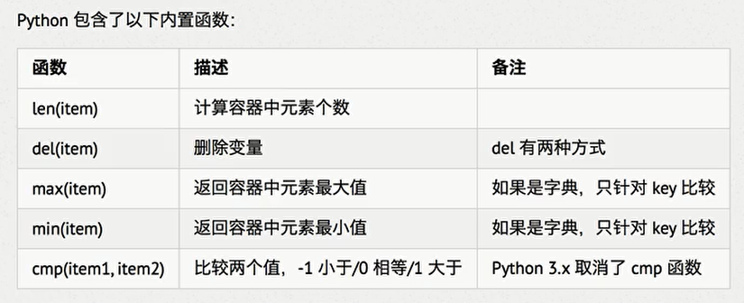
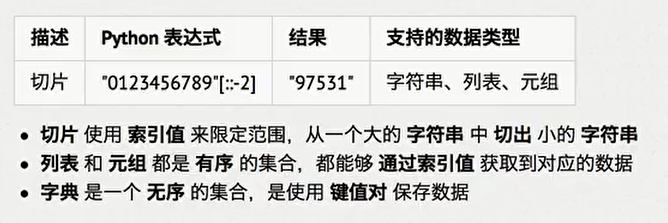
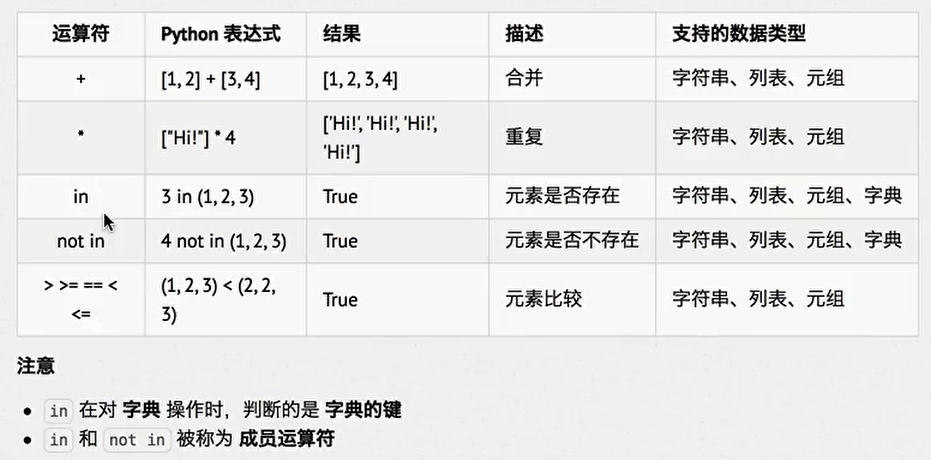
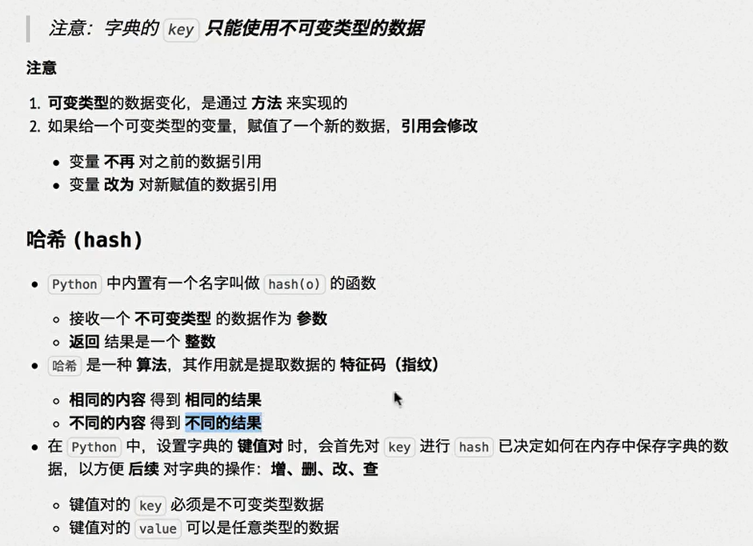
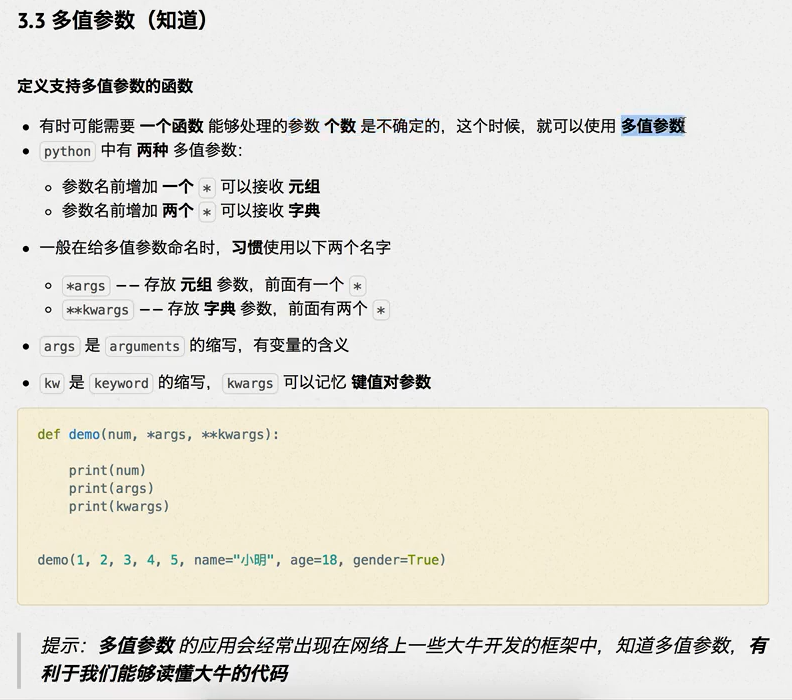
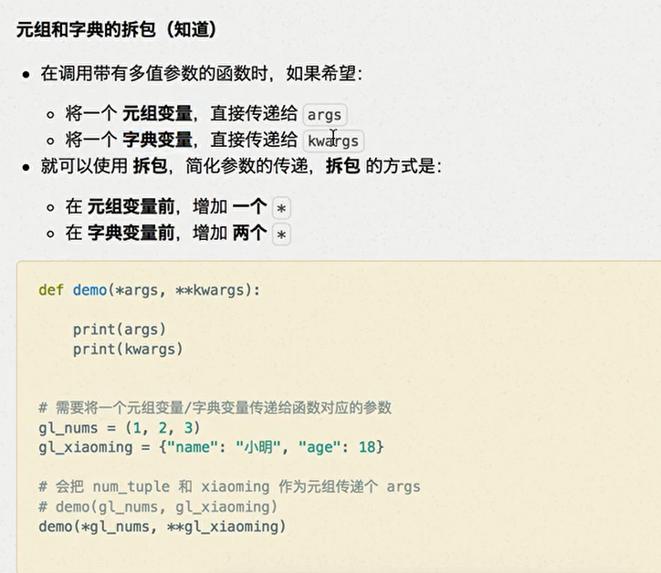

# 高级部分

## 复杂的数据结构

### **列表（list）

```python
# 列表数据结构
sheet_name_lists = ["表格1", "表格2", "表格3", "表格4"]

print(sheet_name_lists)
sheet_name_lists.append(2222)
print("当前列表长度（大小）：", sheet_name_lists.__len__())
sheet_name_lists.remove("表格2")
for s in sheet_name_lists:
    print(s)

print(sheet_name_lists[2])

print(sheet_name_lists.index("表格3"))

```

### 使用del关键字删除列表中的元素

```python
# 列表数据结构
sheet_name_lists = ["表格1", "表格2", "表格3", "表格4"]

print(sheet_name_lists)

del sheet_name_lists[2]

print(sheet_name_lists)

```

### **元组（tuple）

- 特点：
  - 与列表的区别在于，列表可以增删改查，但是元组一旦定义就无法修改
  - 定义方式使用 小括号 加 逗号 的方式（列表是中括号）

- 应用场景
  - 由于元素不可变，所适用于存放不变的信息
  - 例如，函数的参数和返回值

```python
# 元组数据结构
info_tuple = ("123", 456)

print(info_tuple[1])

print(info_tuple)

print(info_tuple.index(456))

for info in info_tuple:
    print(info)

```

### 格式化字符串和元组的关系

```python
print("我稀罕 %s %s %s" % ("x", "d", "f"))

info_tuple = ("x", "d", "f")

info_tuple2 = "w", "f", "m"

print("我稀罕 %s %s %s" % info_tuple)

print("我稀罕 %s %s %s" % info_tuple2)

# 我稀罕 x d f
# 我稀罕 x d f
# 我稀罕 w f m
```

### 元组与列表之间的转换

1. 元组->列表

   ```python
   info_tuple = ("123", 456, "789")
   print(info_tuple)
   info_list = list(info_tuple)
   print(info_list)
   
   ```

2. 列表->元组

   ```python
   info_list = ["111", 222, "333", 444]
   print(info_list)
   info_tuple = tuple(info_list)
   print(info_tuple)
   
   ```


### **字典

- 概述

  - 字典无序，列表有序
  - 字典就是键值对，使用{}定义
  - 键必须唯一

- 定义

  ```python
  # 字典
  # 1.定义
  info_dict = {}
  info_dict.setdefault("name", "芳")
  print(info_dict)
  
  # 2.增删改查
  # 增
  info_dict.setdefault("age", 18)
  info_dict["height"] = 158
  print(info_dict)
  
  # 改
  info_dict["age"] += 1
  print(info_dict)
  info_dict.update(age=20)
  
  # 查
  print("芳龄", info_dict["age"])
  print(info_dict.get("age"))
  # 值不存在会报错
  
  # 删
  info_dict.pop("height")
  print(info_dict)
  del info_dict["age"]
  print(info_dict)
  
  # 字典
info_dict = {"No1": "韩立", "No2": "南宫婉"}
  print(info_dict)

  # 添加
  info_dict["No3"] = "玲珑"
  print(info_dict)
  info_dict.setdefault("No4", "银月")
  print(info_dict)
  
  # 修改
  info_dict["No3"] = "文思月"
  print(info_dict)
  
  # 删除
  del info_dict["No2"]
  print(info_dict)
  info_dict.popitem()
  print(info_dict)
  info_dict.pop("No1")
  print(info_dict)
  
  # 遍历
  info_dict["No5"] = "梓灵仙子"
  for info in info_dict:
      print(info, info_dict[info])
  
  
  ```

### **字符串

  ```python

string = "hello python"
for c in string:
    print(c)
# 字符串简单示例
  ```

**字符串的常用方法**

```python
string = "python " * 3
print(string)
# 计算长度
print(string, "的长度：", len(string))
# count() 函数
s = "p"
print(s, "在字符串", string, "中出现的次数：", string.count(s))
# 获取 s 在字符串中第一次出现的位置
s = "n"
print(s, "在", string, "中第一次出现的下标索引", string.index(s))
# 判断字符中是否只包含 空白字符 ： 空格、tab、换行等
print("  \t\r\n".isspace())

# python python python 
# python python python  的长度： 21
# p 在字符串 python python python  中出现的次数： 3
# n 在 python python python  中第一次出现的下标索引 5
# True
```

**判断字符串数值的方法**

```python
def is_num(string):
    print(string.isdecimal(), string.isdigit(), string.isnumeric())


is_num("123")
is_num("123①")
is_num("123一")
is_num("123.456")

# True True True
# False True True
# False False True
# False False False
```


| 方法                                                         | 描述                                               |
| :----------------------------------------------------------- | :------------------------------------------------- |
| [capitalize()](https://www.w3school.com.cn/python/ref_string_capitalize.asp) | 把首字符转换为大写。                               |
| [casefold()](https://www.w3school.com.cn/python/ref_string_casefold.asp) | 把字符串转换为小写。                               |
| [center()](https://www.w3school.com.cn/python/ref_string_center.asp) | 返回居中的字符串。                                 |
| [count()](https://www.w3school.com.cn/python/ref_string_count.asp) | 返回指定值在字符串中出现的次数。                   |
| [encode()](https://www.w3school.com.cn/python/ref_string_encode.asp) | 返回字符串的编码版本。                             |
| [endswith()](https://www.w3school.com.cn/python/ref_string_endswith.asp) | 如果字符串以指定值结尾，则返回 true。              |
| [expandtabs()](https://www.w3school.com.cn/python/ref_string_expandtabs.asp) | 设置字符串的 tab 尺寸。                            |
| [find()](https://www.w3school.com.cn/python/ref_string_find.asp) | 在字符串中搜索指定的值并返回它被找到的位置。       |
| [format()](https://www.w3school.com.cn/python/ref_string_format.asp) | 格式化字符串中的指定值。                           |
| format_map()                                                 | 格式化字符串中的指定值。                           |
| [index()](https://www.w3school.com.cn/python/ref_string_index.asp) | 在字符串中搜索指定的值并返回它被找到的位置。       |
| [isalnum()](https://www.w3school.com.cn/python/ref_string_isalnum.asp) | 如果字符串中的所有字符都是字母数字，则返回 True。  |
| [isalpha()](https://www.w3school.com.cn/python/ref_string_isalpha.asp) | 如果字符串中的所有字符都在字母表中，则返回 True。  |
| [isdecimal()](https://www.w3school.com.cn/python/ref_string_isdecimal.asp) | 如果字符串中的所有字符都是小数，则返回 True。      |
| [isdigit()](https://www.w3school.com.cn/python/ref_string_isdigit.asp) | 如果字符串中的所有字符都是数字，则返回 True。      |
| [isidentifier()](https://www.w3school.com.cn/python/ref_string_isidentifier.asp) | 如果字符串是标识符，则返回 True。                  |
| [islower()](https://www.w3school.com.cn/python/ref_string_islower.asp) | 如果字符串中的所有字符都是小写，则返回 True。      |
| [isnumeric()](https://www.w3school.com.cn/python/ref_string_isnumeric.asp) | 如果字符串中的所有字符都是数，则返回 True。        |
| [isprintable()](https://www.w3school.com.cn/python/ref_string_isprintable.asp) | 如果字符串中的所有字符都是可打印的，则返回 True。  |
| [isspace()](https://www.w3school.com.cn/python/ref_string_isspace.asp) | 如果字符串中的所有字符都是空白字符，则返回 True。  |
| [istitle()](https://www.w3school.com.cn/python/ref_string_istitle.asp) | 如果字符串遵循标题规则，则返回 True。              |
| [isupper()](https://www.w3school.com.cn/python/ref_string_isupper.asp) | 如果字符串中的所有字符都是大写，则返回 True。      |
| [join()](https://www.w3school.com.cn/python/ref_string_join.asp) | 把可迭代对象的元素连接到字符串的末尾。             |
| [ljust()](https://www.w3school.com.cn/python/ref_string_ljust.asp) | 返回字符串的左对齐版本。                           |
| [lower()](https://www.w3school.com.cn/python/ref_string_lower.asp) | 把字符串转换为小写。                               |
| [lstrip()](https://www.w3school.com.cn/python/ref_string_lstrip.asp) | 返回字符串的左修剪版本。                           |
| maketrans()                                                  | 返回在转换中使用的转换表。                         |
| [partition()](https://www.w3school.com.cn/python/ref_string_partition.asp) | 返回元组，其中的字符串被分为三部分。               |
| [replace()](https://www.w3school.com.cn/python/ref_string_replace.asp) | 返回字符串，其中指定的值被替换为指定的值。         |
| [rfind()](https://www.w3school.com.cn/python/ref_string_rfind.asp) | 在字符串中搜索指定的值，并返回它被找到的最后位置。 |
| [rindex()](https://www.w3school.com.cn/python/ref_string_rindex.asp) | 在字符串中搜索指定的值，并返回它被找到的最后位置。 |
| [rjust()](https://www.w3school.com.cn/python/ref_string_rjust.asp) | 返回字符串的右对齐版本。                           |
| [rpartition()](https://www.w3school.com.cn/python/ref_string_rpartition.asp) | 返回元组，其中字符串分为三部分。                   |
| [rsplit()](https://www.w3school.com.cn/python/ref_string_rsplit.asp) | 在指定的分隔符处拆分字符串，并返回列表。           |
| [rstrip()](https://www.w3school.com.cn/python/ref_string_rstrip.asp) | 返回字符串的右边修剪版本。                         |
| [split()](https://www.w3school.com.cn/python/ref_string_split.asp) | 在指定的分隔符处拆分字符串，并返回列表。           |
| [splitlines()](https://www.w3school.com.cn/python/ref_string_splitlines.asp) | 在换行符处拆分字符串并返回列表。                   |
| [startswith()](https://www.w3school.com.cn/python/ref_string_startswith.asp) | 如果以指定值开头的字符串，则返回 true。            |
| [strip()](https://www.w3school.com.cn/python/ref_string_strip.asp) | 返回字符串的剪裁版本。                             |
| [swapcase()](https://www.w3school.com.cn/python/ref_string_swapcase.asp) | 切换大小写，小写成为大写，反之亦然。               |
| [title()](https://www.w3school.com.cn/python/ref_string_title.asp) | 把每个单词的首字符转换为大写。                     |
| translate()                                                  | 返回被转换的字符串。                               |
| [upper()](https://www.w3school.com.cn/python/ref_string_upper.asp) | 把字符串转换为大写。                               |
| [zfill()](https://www.w3school.com.cn/python/ref_string_zfill.asp) | 在字符串的开头填充指定数量的 0 值。                |

#### 对齐相关方法

```python
poem = ["C",
        "C++",
        "Java",
        "Python"]

for poem_str in poem:
    print(poem_str.center(10))
    
#     C     
#    C++    
#    Java   
#   Python  
```

#### 去空白

```python
# 去除空格 类似其他语言的 trim

string = "    \t\r 你好    "
print(string.strip())   # 你好

```

#### 字符串分割

- split
- join
- splitlines
- partition
- rpartition

#### 切片

```python
string = "123456789"
# 含头不含尾
print(string[1:5])

# 切片截取
# 间隔一个字符截取一个
string = "0123456789"

print(string[::2])
# 倒序输出
print(string[::-1])

```

## 完整的for循环

```python
for s in "string":
    print(s)
    #break # 若使用 break 语句结束循环，则 else 后面的代码不会被执行
else:
    print("遍历完成！")

```

## 容器的公共方法

### 内置函数



### 切片



### 成员运算符

+，*，in，not in，



### 参数的引用



## 全局变量

- 在python中，函数内部不允许直接修改全局变量的值，需要先使用 global 关键字修饰

## 交换两个变量的值

```python
a = 10
b = 30
print(a, b)
# 交换数据
a, b = b, a
print(a, b)
#
(a, b) = (b, a)
print(a, b)
#
[a, b] = [b, a]
print(a, b)
# 。。。
```

## python函数的返回值

- python中允许返回多个值，以元组形式

  ```python
  return a,b
  
  # 接收
  也使用两个变量来接收
  ```

- 函数的默认值

  ```python
  def test(a, b=10):
      print(a, b)
  
  
  test(30)
  # 还可以指定参数名赋值
  test(a=40)
  ```

## 变参函数



